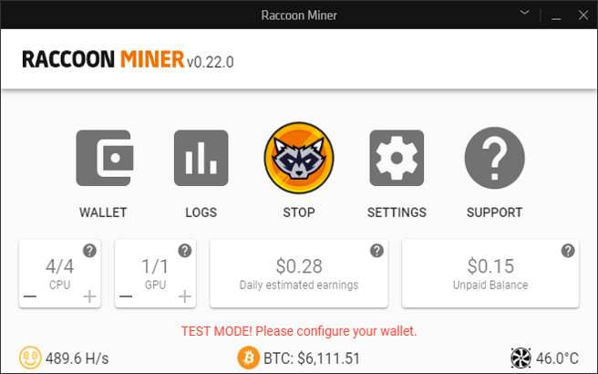

# Raccoon Miner

Raccoon Miner is a crypto mining app for [Overwolf](https://www.overwolf.com/), an appstore for PC games on Windows.
The app supports multi algorithms and is compatible with [NiceHash](https://www.nicehash.com).

## Download app

You can download a pre release from https://www.overwolf.com/app/leon_machens-raccoon_miner.

## Install from source

1.  Download or clone source

- Download `raccoon_miner_x.zip` from [releases](https://github.com/lmachens/raccoon-miner/releases). You might have to force download because of a security warning regarding the mining exe and dll files. Extract the release.
- Clone this project with activated symlink support on Windows with `git clone -c core.symlinks=true git@github.com:lmachens/raccoon-miner.git`. In the `dist` folder you find the dev and production apps.

2.  Download the [Developers version of Overwolf](https://download.overwolf.com/install/Download?Channel=Developers). You can skip this step if you already installed Overwolf.
3.  Start Overwolf and click on Settings (either the wrench icon on the dock, or the Settings button on the tray icon menu).
4.  Go to the Support tab, you will see a link labelled "Development Options". Click that.
5.  Click on "Load unpacked extension" and navigate to the unpackaged archive.

## Develop

1.  Make make sure you loaded the dev version in `dist/dev`
2.  Install dependencies with `npm install`
3.  Run `npm run dev` to start the file watcher and automatic build process
4.  Change code and the app will reload automatically

## Contribute

Contributors are welcome!

## Donations

My BTC address: `3QDZkfUqrzYc2KccWSemuGKUqoMNQmqiDV`
