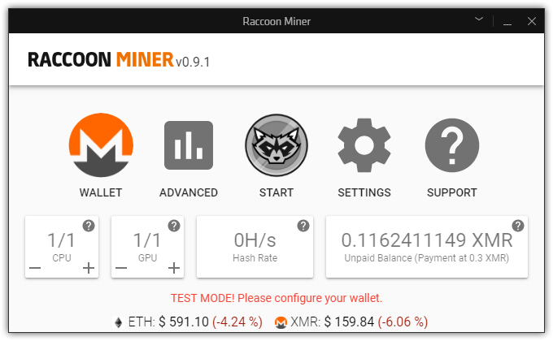

# Raccoon Miner

Raccoon Miner is a crypto mining app for [Overwolf](https://www.overwolf.com/), an appstore for PC games.
The app connects miner like for different currencies to mining pools with a smart UI.

## Install app from releases

Raccoon Miner is not released yet, but you can install from source.

- Download `raccoon_miner_x.zip` from [releases](https://github.com/lmachens/raccoon-miner/releases). You might have to force download because of a security warning regarding the mining exe and dll files.
- Extract the release
- Download the [Developers version of Overwolf](https://download.overwolf.com/install/Download?Channel=Developers). You can skip this step if you already installed Overwolf.
- Start Overwolf and click on Settings (either the wrench icon on the dock, or the Settings button on the tray icon menu).
- Go to the Support tab, you will see a link labelled "Development Options". Click that.
- Click on "Load unpacked extension" and navigate to the unpackaged archive.
